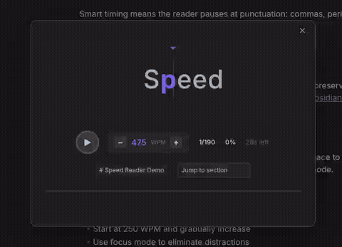

# Speed Reader

Read long Obsidian notes faster without losing focus.

Speed Reader uses RSVP (rapid serial visual presentation) to turn your notes into a focused word-by-word reading flow, so you can move through dense writing, saved articles, drafts, and study notes with less eye movement and fewer distractions.

## Why Speed Reader?

Long notes are easy to skim badly and hard to read deeply. Speed Reader helps you stay locked on one word at a time, control your pace, and finish notes without constantly losing your place.

Use it when you want to:
- Get through long notes faster
- Review research or study material
- Read drafts without visual clutter
- Stay focused when your attention keeps jumping
- Read selected passages without leaving Obsidian

## Features

- **Word-by-word reading** — Read in a focused RSVP view instead of scanning full paragraphs.
- **Optimal recognition point highlighting** — Highlights the key letter in each word to help your eyes recognize words faster.
- **Markdown-aware cleanup** — Removes formatting noise like links, bold text, code, frontmatter, and comments before reading.
- **Natural pacing** — Adds small pauses at punctuation, numbers, and longer words so the flow feels less robotic.
- **Live speed control** — Change WPM, skip forward or backward, and jump between sections while reading.
- **Focus mode** — Hide controls and keep only the current word on screen.
- **Selection support** — Read selected text, or start from the whole note.

## How it works

1. Open a note in Obsidian.
2. Select text, or leave nothing selected to read the full note.
3. Run **Speed Reader: Start speed reading**.
4. Press **Space** to start, pause, or resume.

## Keyboard shortcuts

| Key | Action |
|---|---|
| `Space` | Play / pause |
| `←` / `→` | Skip 10 words |
| `↑` / `↓` | Change speed by 25 WPM |
| `F` | Toggle focus mode |
| `Esc` | Close reader |

## Install

### From Community Plugins

Open **Settings → Community plugins → Browse**, search for **Speed Reader**, then install and enable it.

### Manual install

Download `main.js`, `manifest.json`, and `styles.css` from the [latest release](https://github.com/madhusudan-kulkarni/obsidian-speed-reader/releases/latest), then place them in:

`<vault>/.obsidian/plugins/speed-reader/`

## Good for

- Students reviewing notes
- Writers reading drafts
- Researchers going through saved material
- Anyone who wants a calmer way to read inside Obsidian

## License

[0-BSD](LICENSE)
